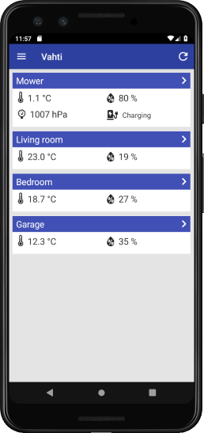
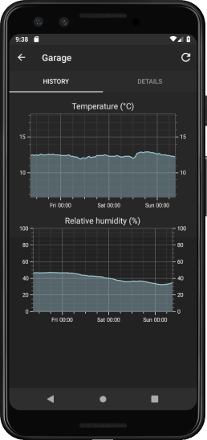
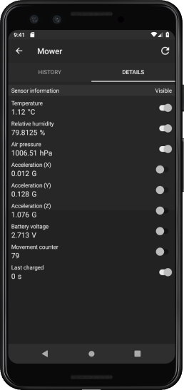
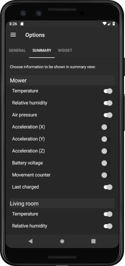

# Vahti

Vahti is a lightweight .NET and MQTT based home monitoring system to read measurement data from different kind of sources. 

It consists of server part (running on Raspberry Pi, for example) to gather data and and mobile app to show it. Alerts (push/email) are also supported. System can also be used without mobile app just to get alerts by email from server, or to publish data for any generic MQTT client application.

## General concepts
- Lightweight. Server runs well on Raspberry Pi (2/3/4 with ARMv7/8)
- No need to expose home network to Internet (data is stored in cloud database)
- No paid services needed
- Can be used without mobile app just as an alert system
- Different services can also be run on different machines
- A 3rd party mobile app (MQTT client) can also be used to display the data

## Features
### Mobile application (Vahti.Mobile)
 

- Implemented with Xamarin Forms 
- Focus has been on Android (iOS app compiled without Apple Developer license works only a week at time)
- Show latest measurement data and history graphs
- Choose which measurements to show on main view
- Get push notifications (alerts) from server 
- Localizable (currently supports Finnish and English)
- Android widget to show selected information on home screen
- No background polling done
### Server (Vahti.Server)
Server can be configured to run all or any of the services below. All services can run on same machine, or they can be distributed to different machines.
#### DataBroker (Vahti.DataBroker)
- Implemented with .NET Core 3.0
- Uses MQTT to gather measurement data from any MQTT client 
- Sends measurements and history data periodically to cloud database (currently Google Firebase)
- Send alerts as push notifications to the mobile application, or as email to any device
#### Collector (Vahti.Collector)
- Implemented with .NET Core 3.0
- Read data from Bluetooth LE and other type of devices, like those connected via GPIO
- Currently supports parsing data of [RuuviTag](https://www.ruuvi.com) and DHT22, but support for other devices can be added
- Uses my [BleReader.Net](https://github.com/ilpork/BleReader.Net) to read BLE data
#### MQTT server
- Wraps the [MQTTnet](https://github.com/chkr1011/MQTTnet) server to provide MQTT server functionality

## System overview

## Requirements
For sending alerts by email or to publish for a generic MQTT client:
1) A server (Linux/Windows/Mac) where to run the server part (Vahti.DataBroker, Vahti.Collector and Vahti.Mqtt). Raspberry Pi 2/3/4 is fine for that purpose
2) Have some measurement sources to publish measurement data using MQTT

To support showing data in mobile app requires (in addition to what's listed above):

3. Android device (building for iOS basically requires Apple developer license, so iOS version has been on side track)
4. Google Firebase realtime database needed for data storage to use the mobile app (free)

For full setup with mobile app and push notifications requires (in addition to what's listed above):
1. Visual Studio 2019 (Community edition is fine) for building (free)
4. Google Firebase project needed to get Push notifications on Android (free) 
5. Microsoft Azure account and notification hub needed for push notifications (free)

## Usage
Depending on configuration and functionality used, the system requires different kind of setup. See details with tutorials in [Getting started](doc/GettingStarted.md)

## Support for iOS
iOS app currently starts up and is able to show data on overview page. There are still many issues and some platform specific functionality has not been implemented yet in iOS app. I'm not focusing on them currently because I'm not sure how many of those who are interested in this project have Apple developer license. 

## Background
Originally I did a very simple version of the system for my own purposes to supervise my robotic lawnmower by using a RuuviTag sensor, and show that information along with other available sensor information anywhere I am, without exposing my home network to Internet. Then I thought that maybe I could make it more generic, so that others could use it too in way that adding support for additional devices isn't too complicated.

I try to document the project so that also those with less development experience could use it. 

Vahti is a Finnish word. It means guard, watch or sentry in English. 

## Contribute
You can raise issues regarding both code and documentation. If you wish to contribute by making a pull request, please first raise an issue.

## License

Copyright (c) ilpork. All rights reserved.

Licensed under the MIT license.