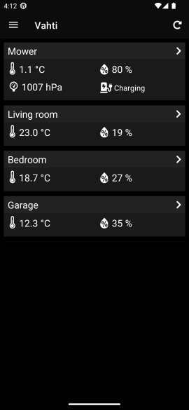
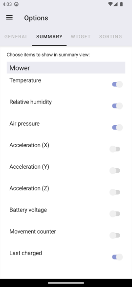

# Vahti

<!--
Hide Netlify badge for now. It indicates incorrectly "failed" when build has been auto-canceled due to site content not changed
https://answers.netlify.com/t/status-badge-incorrectly-shows-failing-when-deploy-is-auto-cancelled/7316
-->

Vahti is a lightweight .NET and MQTT based home monitoring system to read measurement data from different kind of sources. 

Server part (running on Raspberry Pi, for example) gathers data for mobile and web application to show. Alerts (push/email) are also supported. System can also be used without mobile app just to get alerts by email from server, or to publish data for any generic MQTT client application.

## General concepts
- Lightweight. Server runs well on Raspberry Pi (2/3/4 with ARMv7/8)
- No need to expose home network to Internet (data is stored in cloud database)
- No paid services needed
- Can be used without mobile app just as an alert system
- Different services can also be run on different machines
- A 3rd party mobile app (MQTT client) can also be used to display the data

## Features
### Mobile application (Vahti.Mobile)
 
 

- For Android and iOS
- Implemented with .NET MAUI
- Show latest measurement data and history graphs
- Choose which measurements to show in main view
- Get push notifications (alerts) from server 
- Localizable (currently supports Finnish and English)
- Android widget to show selected information on home screen
- Dark and light theme
### Web application (Vahti.Web)

- Implemented with ReactJS
- Show latest measurement data and history graphs
- Choose which measurements to show in main view
- Can be easily deployed to app hosting services
- Use [vahti.netlify.app](https://vahti.netlify.app) either with demo data or your own data

### Server (Vahti.Server)
Server can be configured to run all or any of the services below. All services can run on same machine, or they can be distributed to different machines.
#### DataBroker (Vahti.DataBroker)
- Uses MQTT to gather measurement data from any MQTT client
- Sends measurements and history data periodically to cloud database (currently Google Firebase)
- Send alerts as push notifications to the mobile application, or as email to any device
#### Collector (Vahti.Collector)
- Read data from Bluetooth LE and other type of devices, including those connected via GPIO
- Currently supports parsing data of [RuuviTag](https://www.ruuvi.com) and DHT22, but support for other devices can be added
- Uses my [BleReader.Net](https://github.com/ilpork/BleReader.Net) to read BLE data
#### MQTT server (Vahti.Mqtt)
- Wraps the [MQTTnet](https://github.com/chkr1011/MQTTnet) server to provide MQTT server functionality

## System overview

## Requirements
For sending alerts by email or to publish for a generic MQTT client:
1) A server (Linux/Windows/Mac) where to run the server part (Vahti.DataBroker, Vahti.Collector and Vahti.Mqtt). Raspberry Pi 2/3/4 is fine for this
2) Have some measurement sources to publish measurement data using MQTT

To support showing data in mobile app requires (in addition to what's listed above):

3. Android or iOS device (building for iOS basically requires Apple developer license)
4. Google Firebase real-time database needed for data storage to use the mobile app (free)

For full setup with mobile app and push notifications requires (in addition to what's listed above):
1. Visual Studio 2022 (Community edition is fine) for building (free)
4. Google Firebase project needed to get push notifications on Android (free) 
5. Microsoft Azure account and notification hub needed for push notifications (free)

Web application can be used instead of (or along with) with mobile app. It can be easily deployed to Netlify, for example, or use existing [vahti.netlify.app](https://vahti.netlify.app) to view your data.

## Usage
Depending on configuration and functionality used, the system requires different kind of setup. 

See details with tutorials in [Getting started](doc/GettingStarted.md)

**2023-08, iOS note: current `master` branch uses .NET 7 and MAUI. There are still layout issues with iOS on MAUI (due to various MAUI bugs), so if you want to build for iOS, use `iOS` branch (or  tag `v1.2.3` from `master`) for now. It uses Xamarin.Forms and still works.**

## Background
Originally I did a very simple version of the system for my own purposes to supervise my robotic lawnmower by using a RuuviTag sensor. Then I thought that maybe I could make it more generic, so that adding support for additional devices isn't too complicated. I've tried to document the project so that also those with less development experience could use it (see [Getting started](doc/GettingStarted.md))

Vahti is a Finnish word. It means guard, watch or sentry in English. 

## Contribute
You can raise issues regarding both code and documentation. If you wish to contribute by making a pull request, please first raise an issue.

## License

Copyright (c) ilpork. All rights reserved.

Licensed under the MIT license.